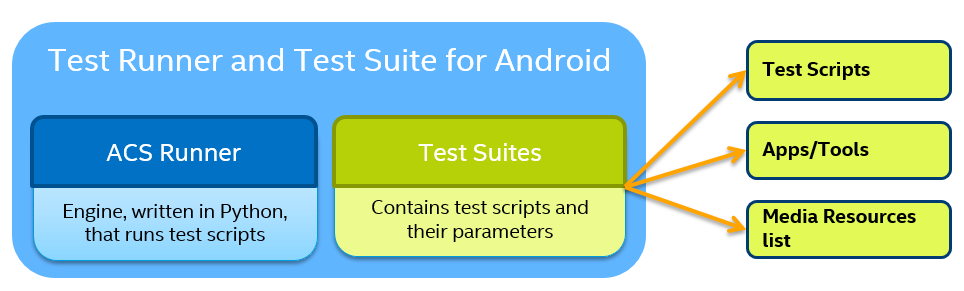

DISCONTINUATION OF PROJECT

This project will no longer be maintained by Intel.

Intel has ceased development and contributions including, but not limited to, maintenance, bug fixes, new releases, or updates, to this project.  

Intel no longer accepts patches to this project.

If you have an ongoing need to use this project, are interested in independently developing it, or would like to maintain patches for the open source software community, please create your own fork of this project.  

Contact: webadmin@linux.intel.com
# Test Runner and Test Suite for Android
Tests runner framework and test suites (automated) for validation of the Android projects 

### ACS Runner

**ACS** stands for *Automation Control System.*

ACS is a Test Automation Framework written in *Python* for Quality Assurance.
It is a host based test solution: the engine runs on the host rather than on the device under test.

As a Test Runner, It can:

* Execute test plan (aka test campaigns)
* Control test equipment like network hub, USB relay, etc.
* Gather all logs from test device
* Create associated report.

Refer to [ACS Document](docs/ACS.md) for detail.

### Test Suite

Test Suites including

* Test scripts based on various case design for different domains, like Audio, Video, Camera functionality testing etc.
* Test Application and Tools that are being used by test scripts
* Media resources list that are used during test execution

Available test suite are in `acs_test_suites` folder. Currently we have [Test Suite for Android](acs_test_suites/OTC/README.md).

### Test Environment Setup

Refer to [Setup Document](acs_setup_manager/README.md) for detail.

### Recommeded device under test

Refer to [DUT Document](docs/DUT.md)

## Contribute
Follow [Contributing Guidelines](CONTRIBUTING.md)

## Mailing List
https://eclists.intel.com/sympa/info/test-framework-suites-for-android

## License
[Apache License 2.0](LICENSE)
