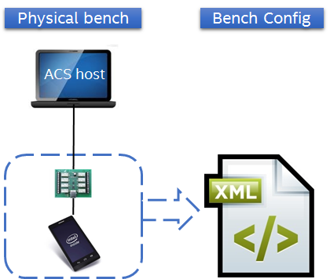
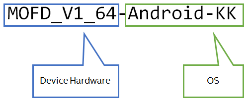

## Bench Definition

To enable ACS execution, user has to describe the configuration of the bench in the **bench configuration file**.

* Bench configuration defines the hardware setup (connected devices, equipments, ...)
* By default, ACS uses Bench_Config.xml, located in ACS execution folder (*acs/acs/_ExecutionConfig*)



### Where to find device models supported by ACS
In ACS context, a **device model** corresponds to the configuration of a DUT.

A device model is composed of :



The user can also get the list of supported device models using ACS command line. This command will return the list of available device models.

```bash
$ cd acs/acs
$ python ACS.py --device_models
Android
Dummy
multi
```

All equipment supported by ACS are listed in following folder.
`acs_test_scripts/src/_Templates/BenchConfigs/EQUIPMENT`

## BenchConfig File
The bench configuration is an **XML** file which is composed of two sections:

* Phone parameters
* Equipment parameters

Bench Config template can be found at `acs/acs/_Templates/BenchConfigs/Bench_Config_Template.xml`
```xml
<?xml version="1.0" encoding="iso-8859-1"?>
<BenchConfig version="13.41">
    <Phones>
        <!--
            To configure devices, please refer to _Templates\BenchConfigs\DUT folder ...
        -->
    </Phones>
    <Equipments>
        <!--
            To configure equipments, please refer to _Templates\BenchConfigs\EQUIPMENT\<EQUIPMENT_TYPE> folder(s) ...
        -->
    </Equipments>
</BenchConfig>
```

### Phones Section
With the phone/device parameters section, users can define what device model to use and set its parameters.

Users can fill this section by using templates from the following folder:
```
acs/acs/_Templates/BenchConfigs/DUT
```

##### Phones section can be empty

Users can keep that section empty, if no update of device parameters is needed.
```xml
<Phones>
    <!-- This section can be empty. -->
</Phones>
```
**Note**: In this case users shall provide the device model through the command line. (see Running ACS for more information)
```
~/acs/acs >python ACS.py -d Android ...
```
##### Set device model without parameters
In this case, the device model will use the parameter’s value set in the *Device Catalog*

Device catalog can be found in `acs_test_suites/_Catalogs/Device/Models/`.
Each device model has a configuration file in this catalog. Refer to the device config file corresponding to your device to get an exhaustive list of the parameters.

Example:
```xml
<Phones>
    <Phone name="PHONE1" deviceModel="Android" description="Phone to use during test campaign.">
        <!-- Parameter section can be empty. -->
    </Phone>
</Phones>
```
Note: Users do not need to provide the device model through the command line.

##### Set device model with parameters
By default, device parameters are defined in the Device Catalog

For a given device model, users can override parameters in the BenchConfig.

Example:

Default value in Device Catalog:
```xml
<DeviceModel>
    ...
    <BootShutdown>
        <Parameter bootTimeout="800"/>
        ...
    </BootShutdown>
    ...
</DeviceModel>
```
Overridded *bootTimeout* to 900 in BenchConfig file:
```xml
<Phones>
    <Phone name="PHONE1" deviceModel="Android">
        <Parameter bootTimeout="900" />
     </Phone>
</Phones>
```

### Equipment section
TODO
