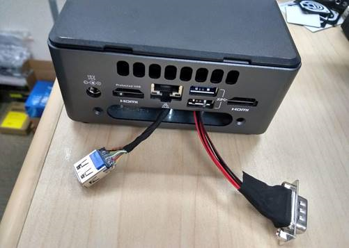

#List recommended device under test (DUT)

###For Celadon P validation:

Intel NUC Kit [NUC7i5DNHE](https://www.intel.com/content/www/us/en/products/boards-kits/nuc/kits/nuc7i5dnhe.html)
DDR4 SODIMMs memory
m.2 or 2.5” drive storage
Dawson Canyon USB3.0 [Header Cable](https://www.gorite.com/dawson-canyon-usb-3-0-female-to-10-pin-header-cable)
Dawson Canyon serial DB9 [Header Cable](https://www.gorite.com/serial-db9-header-cable-for-nuc-dawson-canyon)

###For Celadon O validation:

Intel NUC Kit [NUC7i5BNH](https://www.intel.com/content/www/us/en/products/boards-kits/nuc/kits/nuc7i5bnh.html)
DDR4 SODIMMs memory
m.2 or 2.5” drive storage
