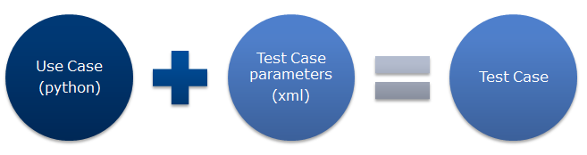
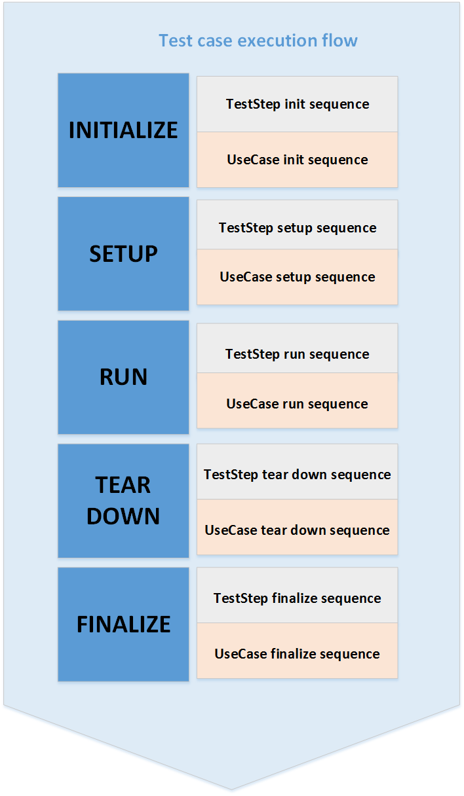
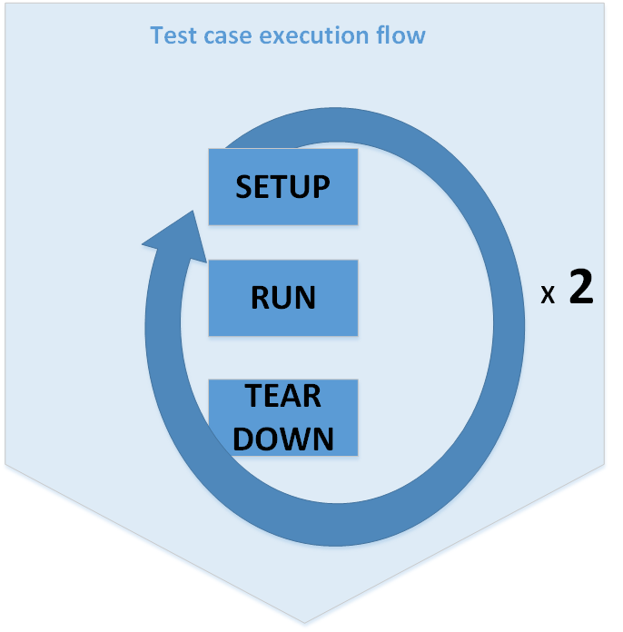
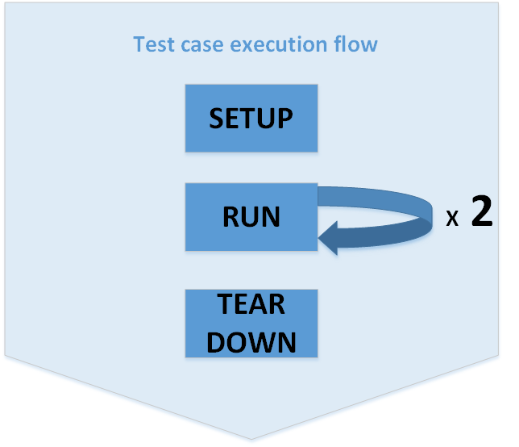
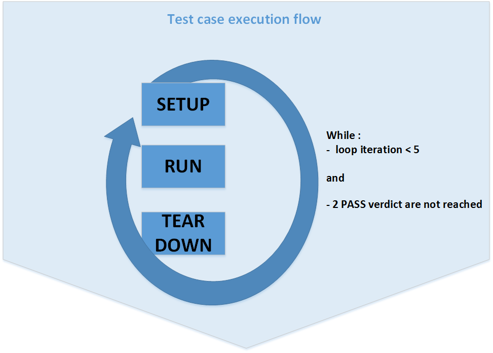

## Test Case Definition
A Test Case (TC) is an XML file that describes a test scenario.


It relies on a Use Case (python script), and is used to change parameters of this use case.
Many test cases can rely on the same use case.
For example, a use case `AudioPlayback` can be used in test cases `Play_MP3.xml` and `Play_Wave.xml`.

### Test Case Sequence
A TC runs in 5 phases:



* **initialize** used for technical needs
* **setup** prepares the test (gather data, set DUT and equipments in the right state, ...)
* **run** executes the test scenario
* **tear down** clean everything that was changed during test execution
* **finalize** used for technical needs

> Note: Test Steps sequence can also be defined.


### Test Case Anatomy

```xml
<?xml version="1.0" encoding="iso-8859-1"?>
<TestCase>

    <!-- header -->
    <UseCase>LIVE_BT_SCAN</UseCase>
    <Description>BlueTooth Scan of list of devices in range</Description>
    <b2bIteration>2</b2bIteration>
    <b2bContinuousMode>False</b2bContinuousMode>
    <TcMaxAttempt>2</TcMaxAttempt>
    <TcAcceptanceCriteria>1</TcAcceptanceCriteria>
    <TcExpectedResult>PASS</TcExpectedResult>
    <isCritical>False</isCritical>
    <!-- end header -->

    <Parameters>
        <Parameter>
            <!-- List of BlueTooth device (address or name) to search within range. semi-colon (;) as separator
                Let field empty to use MacAddress parameter of BT_DEVICE equipment in bench_config file -->
            <Name>DEVICE_TO_SEARCH</Name>
            <Value>BB:bt_apn</Value>
        </Parameter>
        <Parameter>
            <!-- [Optional] Is set to True, the flight mode will be enables before setting bt on
                and disabled at tear down. -->
            <Name>FLIGHT_MODE</Name>
            <Value>False</Value>
        </Parameter>
    </Parameters>
</TestCase>
```

As you can see, Test Case is composed of two sections:
* a **header** that contains Test Case configuration
* a **Parameters** section, that will contain specific parameters to the test case


#### Head options
in the header, you will find the following information:

Parameter|Description|Example
------------ | ------------- | ----------
**UseCase**          | Use case to run. |`<UseCase>LIVE_BT_SCAN</UseCase>`
**Description**      | Information about the test case. this field is important for re-use between users. | `<Description>BlueTooth Scan of list of devices in range</Description>`
**b2bIteration**     | This will run the test loop multiple times consecutively. | `<b2bIteration>2</b2bIteration>`
**b2bContinuousMode**| if this parameter is set to True, only the 1st iteration will do the **setup** part of the use case.  Next iterations will only run the **run** part of the use case. The last iteration will do the **tear down** part of the use case.  | ` <b2bContinuousMode>False</b2bContinuousMode>`
**TcAcceptanceCriteria**  | Defines the number of expected verdict to reach to declare the test as PASS.  | `<TcAcceptanceCriteria>1</TcAcceptanceCriteria>`
**TcMaxAttempt**     | Defines the number of attempts that can be done to reach the acceptance criteria value. | `<TcMaxAttempt>2</TcMaxAttempt>`
**TcExpectedResult** | the expected verdict to declare the test as pass. available values are **PASS**, **FAIL** and **BLOCKED**. | `<TcExpectedResult>PASS</TcExpectedResult>`
**isCritical**       | If this parameter is set to true, this test case is mandatory and a failure should stop the campaign execution. | `<isCritical>False</isCritical>`

#### Examples


B2B not continuous mode:


```xml
<TestCase>
    <b2bIteration>2</b2bIteration>
    <b2bContinuousMode>False</b2bContinuousMode>
    <TcMaxAttempt>1</TcMaxAttempt>
    <TcAcceptanceCriteria>1</TcAcceptanceCriteria>
    <TcExpectedResult>PASS</TcExpectedResult>
    ...
</TestCase>
```


B2B continuous mode:

```xml
 <TestCase>
     <b2bIteration>2</b2bIteration>
     <b2bContinuousMode>True</b2bContinuousMode>
     <TcMaxAttempt>1</TcMaxAttempt>
     <TcAcceptanceCriteria>1</TcAcceptanceCriteria>
     <TcExpectedResult>PASS</TcExpectedResult>
     ...
 </TestCase>
```

Case retry mode:


```xml
 <TestCase>
     <b2bIteration>1</b2bIteration>
     <b2bContinuousMode>True</b2bContinuousMode>
     <TcMaxAttempt>5</TcMaxAttempt>
     <TcAcceptanceCriteria>2</TcAcceptanceCriteria>
     <TcExpectedResult>PASS</TcExpectedResult>
     ...
 </TestCase>
```
